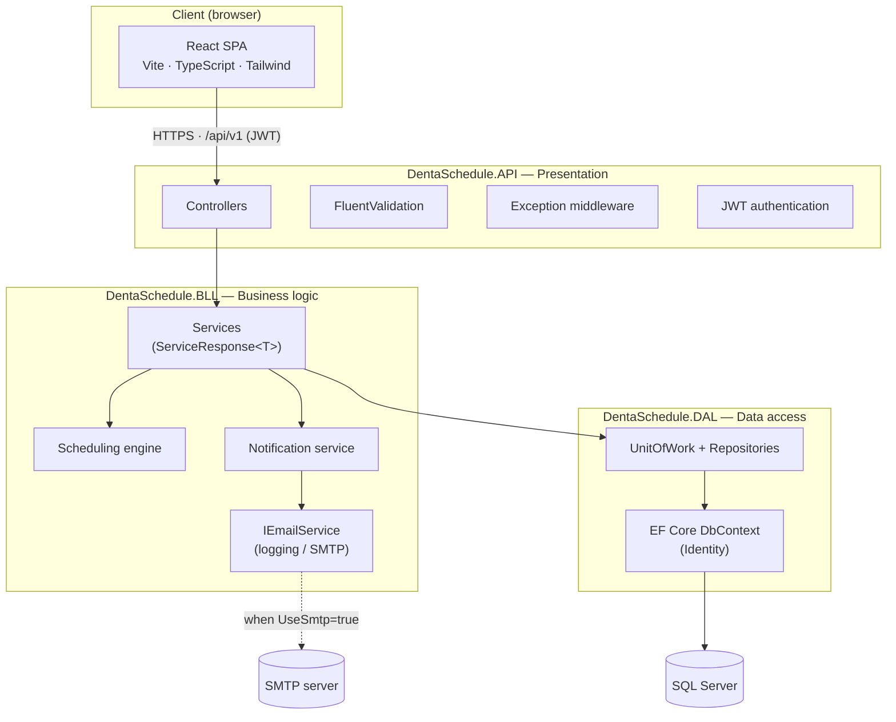
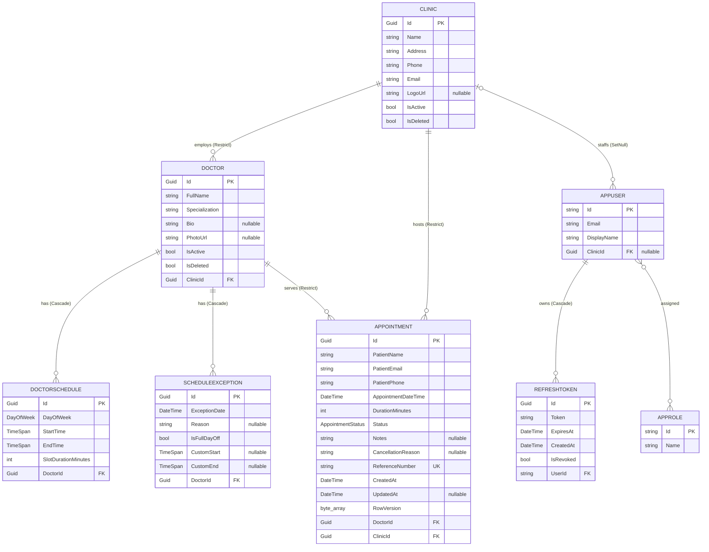
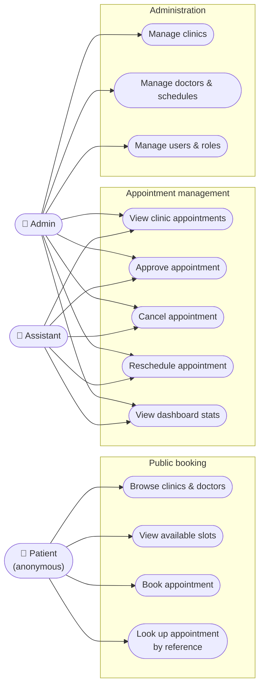
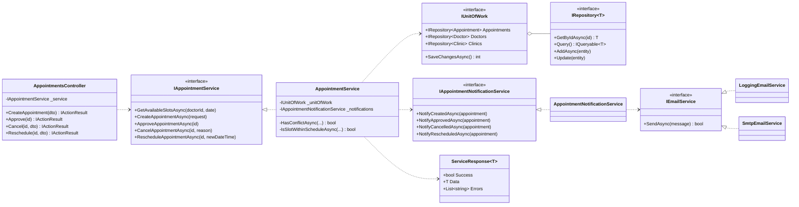
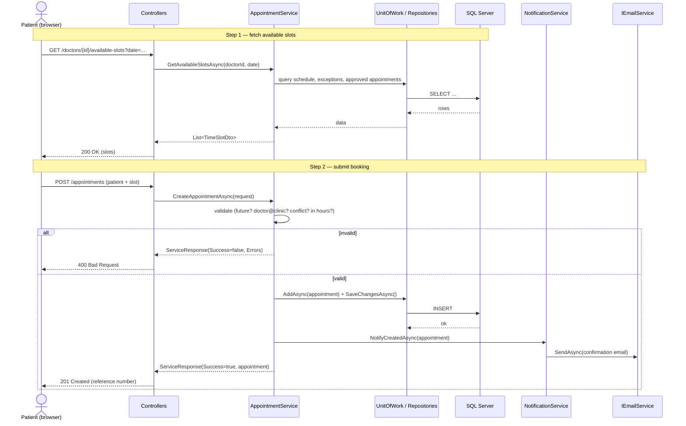

# DentaSchedule — Design Diagrams

This document collects the design diagrams for the DentaSchedule system. They are written
in [Mermaid](https://mermaid.js.org/), so they render automatically on GitHub. To export a
figure for the thesis (SVG/PNG), paste a block into <https://mermaid.live> or use the
"Markdown Preview Mermaid Support" / "Mermaid Editor" extension in VS Code.

Contents:
1. [System architecture](#1-system-architecture)
2. [Entity–relationship diagram](#2-entityrelationship-diagram)
3. [Use-case diagram](#3-use-case-diagram)
4. [Class diagram (appointment slice)](#4-class-diagram-appointment-slice)
5. [Sequence diagram — booking an appointment](#5-sequence-diagram--booking-an-appointment)

---

## 1. System architecture

Three-layer backend with a clear dependency direction (Presentation → Business → Data),
a React single-page app on the client, and SQL Server / SMTP as external resources.

---

## 2. Entity–relationship diagram

The persistent domain model. Authentication tables (`AppUser`, `AppRole`, `RefreshToken`)
come from ASP.NET Core Identity; the remaining standard Identity tables are omitted for
clarity. `Clinic` and `Doctor` use soft deletes (`IsDeleted`). Foreign-key delete
behaviour is noted on each relationship.

---

## 3. Use-case diagram

Three actors. The **Patient** is anonymous (no account); **Assistant** and **Admin**
authenticate, with the Assistant scoped to a single clinic. Mermaid has no native UML
use-case notation, so this is an approximation using a graph (ovals = use cases).

---

## 4. Class diagram (appointment slice)

The appointment vertical slice, showing the three-layer pattern: a thin controller
depending on a service interface, a service returning `ServiceResponse<T>` and depending on
the Unit of Work and the notification abstraction, and the transport-agnostic email
abstraction with two implementations. Other slices (clinics, doctors, users) follow the
same shape.

---

## 5. Sequence diagram — booking an appointment

The public booking flow: the patient first fetches available slots, then submits a
booking. The service validates the request (future date, doctor belongs to the clinic, no
conflict with an approved appointment, within working hours) before persisting and
dispatching a confirmation email. A failed validation returns early with no side effects.

